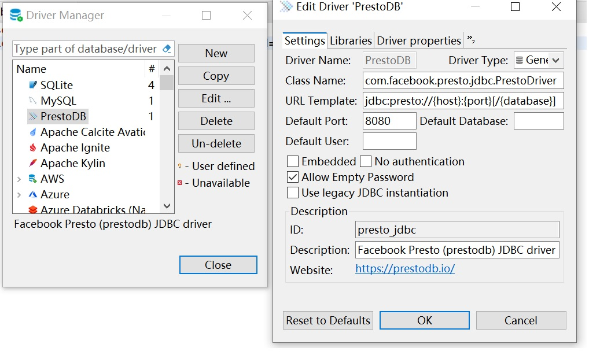
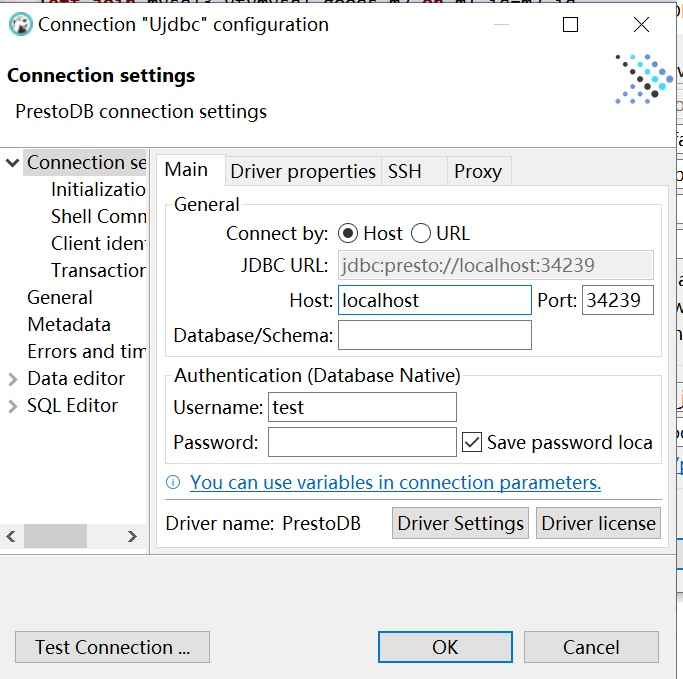
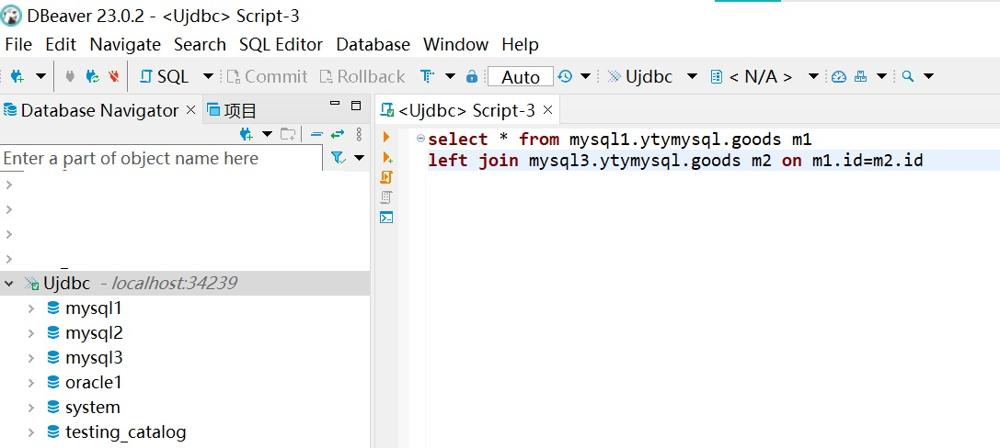

# UJDBC 通用JDBC驱动
A universal JDBC driver that supports simultaneous connection to multiple types of data sources and supports federated queries.
When initializing a new connection with this driver, you can use the standard methods of JDBC to create a new bogus server of Presto, may use 400-500MB memory. The bugos server's life cycle is the same as the JDBC connection.
The first connection will be established in 4 seconds on CPU i5-1135G7.
Currently, it has been tested with Mysql, Oracle and SQLServer databases.

## Mission and Architecture
This driver is based on Presto, thanks for their works. When the JDBC driver establishes a connection (PrestoConnection), it starts a virtual "Presto server" (PrestoConnection.server), and then create a query executor (queryExecutor). Then, it can execute SQL statements via statement.executeQuery().
## Requirements
* Windows or Mac OS X or Linux
* Java 8 Update 151 or higher (8u151+), 64-bit. Both Oracle JDK and OpenJDK are supported.
* Maven 3.6.1+ (for building)

## Build 
It is recommended to use maven wapper for building, and the Maven address has been modified to a mirror of China located at:
.mvn\wrapper\maven-wrapper.properties
If your are not in China, you can change it to the official Maven repository.
The build command is as follows: 
./mvnw package -DskipTests -T4

# 通用JDBC驱动
一个通用的JDBC驱动，可同时连接多种类型数据源，支持联邦查询（跨数据库的表之间做关联）。使用者只需要建立一个连接，就可以查询多个数据库。
当前已经测试过Mysql、Oracle、SQLServer、达梦、OceanBase数据库。

当初始化一个新的JDBC连接时，本驱动将会在进程内创建一个虚拟的Presto服务器，约使用400-500MB内存。虚拟服务器的生存周期与JDBC连接相同。
第一次连接时，在CPU i5-1135G7上需要约4秒钟。

## 架构设计
本驱动基于Presto。当JDBC驱动建立一个连接（PrestoConnection）时，它会在进程里启动一个虚拟的“Presto服务器”（PrestoConnection.server），并建立一个查询执行器（queryExecutor），然后通过PrestoConnection建立一个statement，调用statement.executeQuery()执行SQL语句。

未来计划实现的功能：一是支持更多XC数据库，如达梦、OceanBase、Inceptor、人大金仓、南大通用等。二是从认证、端口保护等途径实现更高的安全性。三是项目结构、代码的规范化。四是用户建议的其他功能。

## 使用要求
* Windows or Mac OS X or Linux
* Java 8 Update 151 or higher (8u151+), 64-bit. Both Oracle JDK and OpenJDK are supported.
* Maven 3.6.1+ (for building)

## 构建命令
建议使用maven wapper构建，maven地址已经被修改为国内镜像，位于：
.mvn\wrapper\maven-wrapper.properties
命令如下： 
./mvnw package -DskipTests -T4

## 使用方法
### 仅测试使用
当前代码支持Mysql、Oracle、SQLServer数据库，如果仅做测试可以直接下载编译好的ujdbc-0.290.jar文件。遵循以下步骤：
1. 建立数据源：在系统中建立环境变量UJDBC_PROPERTIES，指定一个路径，在路径下放置若干数据源配置文件，文件的名称就是数据源的catalog名称。文件内容可参考examples目录下的示例。
2. 在Dbeaver（该驱动不支持24版本，最高23版）中修改PrestoDB驱动，

如果要测试其他类型的数据库，参考下一节内容。

### 添加数据库的的种类，以访问SqlServer数据库为例，需要3步：
1. 在BogusPrstServer.java中添加指定数据库的插件：
queryRunner.installPlugin(new SqlServerPlugin()); // 安装插件，用于访问MySQL数据库
2. 在BogusPrstServer.java中或者在环境变量UJDBC_PROPERTIES指定的路径下建立数据源配置文件。
如果是写在BogusPrstServer.java中，则在get_BogusPrestoServer()方法中添加：
queryRunner.createCatalog("your_catalog_name", "sqlserver", ImmutableMap.of("connection-url", "jdbc:oracle://ip:port:xxx", "connection-user", "xxx", "connection-password", "xxx"));
如果是写在环境变量UJDBC_PROPERTIES指定的路径下，则路径下放置一个以your_catalog_name.properties为名的文件，内容如下：
connection-url=jdbc:sqlserver://ip:port;databaseName=xxx
connection-user=xxx
connection-password=xxx
3. 在pom.xml中添加插件的依赖：
<dependency>
    <groupId>com.facebook.presto</groupId>
    <artifactId>presto-sqlserver</artifactId>
</dependency>
## 已知问题
1. 在DBeaver中访问Oracle数据库时（我仅测试了11C），第一次查询后会花费10分钟左右时间访问元数据，此期间一直卡住不动。此后一切正常。
Support DM, OceanBase.
Correct some bugs.
The presto-oracle has a bug: if scale is larger than precision, it fails. For Oracle 11C, I found this situation actrually exists.